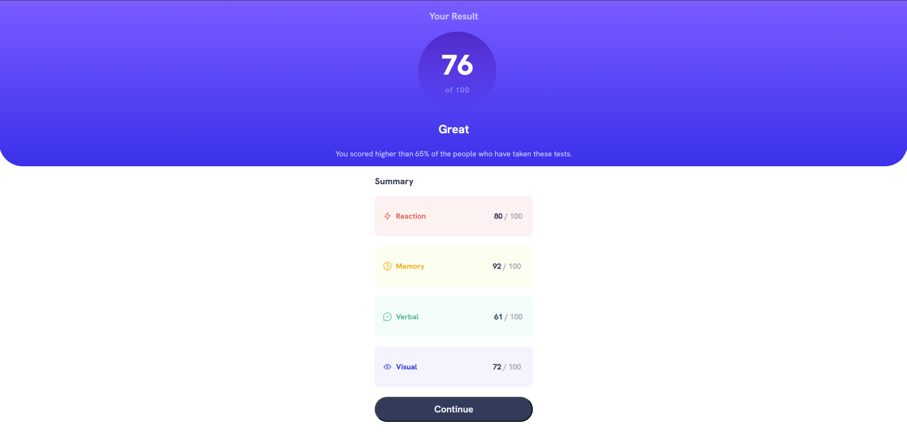

# AISA Solution Front-End Engineer Intern Challenge - Results summary component

This is a solution to the [Results summary component challenge on Frontend Mentor](https://www.frontendmentor.io/challenges/results-summary-component-CE_K6s0maV). Frontend Mentor challenges help you improve your coding skills by building realistic projects. 

## Table of contents

- [Overview](#overview)
  - [Screenshot](#screenshot)
  - [Links](#links)
- [My process](#my-process)
  - [Built with](#built-with)
  - [What I learned](#what-i-learned)
  - [Continued development](#continued-development)
  - [Useful resources](#useful-resources)
- [Author](#author)
- [Acknowledgments](#acknowledgments)

## Overview

### Screenshot



### Links

- Solution URL: [https://github.com/J-Tell/AISA-Code-Challenge]
- Live Site URL: [https://j-tell.github.io/AISA-Code-Challenge/]

## My process

### Built with

- HTML
- CSS
- JavaScript

### What I learned

```html
<div><button class="button"><p class="continue">Continue</p></button></div>
```
This part of HTML was interesting because I used three tags in one line of code, which allowed me to apply multiple CSS classes to one aspect of my program.

```css
#gradient-circle {
  background-image: linear-gradient(hsla(256, 72%, 46%, 1), hsla(241, 72%, 46%, 0));
}
```
#gradient-circle was something new I learned because I had never made a gradient in CSS before.

``` css
@font-face {
  font-family: 'HankenGrotesk';
  src: url('assets/fonts/HankenGrotesk-VariableFont_wght.ttf');
}
```
Working with pre-imported fonts was also new to me, so I had to research the syntax to add the multiple fonts to the code.

### Continued development
These are some things I want to improve on:
- Mobile View: Having a better mobile view will allow users to view the website on any device, so I hope to learn more about ems to apply them to my projects.
- Headers and Divs: Headers and divs help group together portions of the code, so improving these would help me move and position large portions of the code.
- JavaScript: JavaScript would provide a more dymanic website interaction compared to JavaScript, as it would prevent me from having to hard-code projects,

### Useful resources

- [W3Schools CSS Gradients](https://www.w3schools.com/css/css3_gradients.asp) - This helped me learn how to make gradients in CSS.
- [W3Schools CSS Font-Face](https://www.w3schools.com/cssref/atrule_font-face.php) - This helped me learn the syntax required to use imported fonts.

## Author

- Website - [https://github.com/J-Tell/]
- LinkedIn - [https://www.linkedin.com/in/jeannelle-t-9563a932b/](https://www.linkedin.com/in/jeannelle-t-9563a932b/)

## Acknowledgments

Thank you to my friends in my dorm for moral support and helping me make sure my code matched the exam.

Thank you to Amirali Rezaei for telling me about this position and answering my questions at the Entrepreneurship Open House.